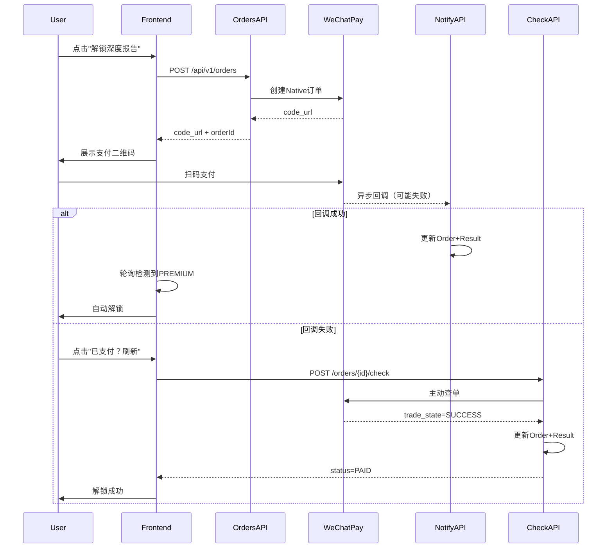

# 开启支付入口 + 修复回调失败

## 现状分析

当前"解锁深度报告"按钮调用 `handleUnlockPremium()` 直接免费设置 `purchasedTier = PREMIUM`。支付流程代码（`handlePay`、`PaymentPanel`、订单创建、回调处理）已完整实现但未连接到 UI 入口。

价格已配置正确：

- [src/lib/payment/constants.ts](src/lib/payment/constants.ts): `PREMIUM: 1990`（19.90 元）
- [src/app/result/[sessionId]/page.tsx](src/app/result/[sessionId]/page.tsx) L2293: `price={19.9}`, `originalPrice={29.9}`

回调失败的根因：微信异步回调可能因验签失败/网络问题未成功更新订单，且当前"点击刷新解锁"只是重新拉取数据库数据，如果回调没有更新数据库，刷新也无法解锁。

## 改动计划

### 1. 将免费解锁按钮改为付费入口

**文件**: [src/app/result/[sessionId]/page.tsx](src/app/result/[sessionId]/page.tsx) ~L1759-1764

- 将 `onClick={() => void handleUnlockPremium()}` 改为调用新函数 `handleOpenPayDialog()`
- 新函数设置 `setPayDialogOpen(true)` 并调用 `handlePay("WECHAT")`
- 按钮文案改为显示价格信息：`<del>¥29.90</del> ¥19.90 解锁深度报告`

### 2. 新增主动查单 API（修复回调失败核心问题）

**新文件**: `src/app/api/v1/orders/[orderId]/check/route.ts`

- 接收 orderId，查询本地订单
- 如果订单已 PAID，直接返回成功
- 如果订单 PENDING，调用微信/支付宝主动查单接口：
  - 微信：`pay.query({ out_trade_no })` 查询交易状态
  - 支付宝：通过 SDK 查询交易状态
- 如果查到已支付，在事务中更新 `Order.status=PAID` + `Result.purchasedTier=PREMIUM`
- 返回最新状态给前端

### 3. 在 wechat.ts 中新增查单函数

**文件**: [src/lib/payment/wechat.ts](src/lib/payment/wechat.ts)

新增 `queryWechatOrder(outTradeNo)` 函数，调用微信 `transactions/out-trade-no/{out_trade_no}` 接口查询订单状态。

### 4. 更新"支付已完成？"刷新按钮

**文件**: [src/app/result/[sessionId]/page.tsx](src/app/result/[sessionId]/page.tsx) PaymentPanel 组件

- `onRefresh` 回调改为先调用 `POST /api/v1/orders/[orderId]/check`（主动查单）
- 查单成功（PAID）后再调用 `onRefetchResult()` 刷新页面数据
- 这样即使异步回调失败，用户点击"已支付？刷新"也能主动同步状态

### 流程图

### 5. 不需要改动的文件

- [src/lib/payment/constants.ts](src/lib/payment/constants.ts) - 价格已正确（PREMIUM: 1990 = 19.90 元）
- [src/app/api/v1/payment/wechat/notify/route.ts](src/app/api/v1/payment/wechat/notify/route.ts) - 回调逻辑本身没有bug，保持不变
- [src/app/api/v1/orders/route.ts](src/app/api/v1/orders/route.ts) - 订单创建逻辑正常

